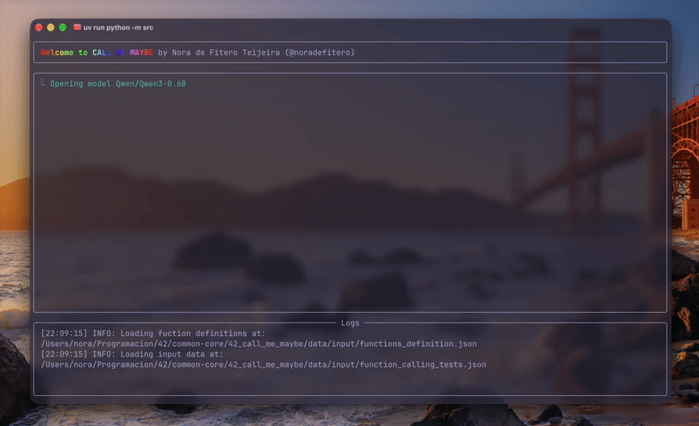

*This project has been created as part of the 42 curriculum by dde-fite*

<div align="center">
    
    <h3>Function calling in LLMs</h3>
</div>
<div align="center">
    	<a href="https://projects.intra.42.fr/projects/call-me-maybe/projects_users/4996964">
			
		</a>
		
		
</div>
<br>
<div align="center">
    
</div>

---

## Usage

```bash
uv sync                                   # or: make install
uv run python -m src                      # or: make run
```

With no arguments the program reads `data/input/functions_definition.json` and
`data/input/function_calling_tests.json` and writes
`data/output/function_calling_results.json`.

| Flag | Short | Default |
|---|---|---|
| `--functions-definition` / `--functions_definition` | `-f` | `data/input/functions_definition.json` |
| `--input` | `-i` | `data/input/function_calling_tests.json` |
| `--output` | `-o` | `data/output/function_calling_results.json` |
| `--system-prompt` | | *(read from a file; unused as a value)* |
| `--system-prompt-file` | | bundled `templates/system.md` |
| `--model` | `-m` | `Qwen/Qwen3-0.6B` |
| `--version` | | |

The subject writes the first flag with an underscore, so both spellings are
declared and both work:

```bash
uv run python -m src \
  --functions_definition data/input/functions_definition.json \
  --input data/input/function_calling_tests.json \
  --output data/output/function_calling_results.json

# same thing, hyphenated
uv run python -m src -f data/input/functions_definition.json -i data/input/function_calling_tests.json -o /tmp/out.json
```

Note that `--system-prompt` has no short form; only `--functions-definition`,
`--input`, `--output` and `--model` do.

Output shape — one object per prompt, in input order, keys exactly
`prompt`, `name`, `parameters`:

```json
[
    {
        "prompt": "What is the sum of 2 and 3?",
        "name": "fn_add_numbers",
        "parameters": { "a": 2.0, "b": 3.0 }
    }
]
```

## Description

Function calling in LLMs, for a 0.6B-parameter model that is not reliable on its
own.

The usual approach is to prompt the model with the available functions and hope
the reply is JSON, then parse it. With `Qwen/Qwen3-0.6B` that fails routinely:
the reply arrives wrapped in prose, misses a required key, or names a function
that does not exist, and the program has to handle a broken string every time.

This project removes the possibility instead of handling it. The model never
emits free-form text. At every decoding step the candidate tokens are ranked by
logit and each is tested against a JSON grammar built from the loaded function
definitions; the highest-logit token that keeps the answer a valid prefix is the
one emitted. The output is valid JSON and schema-compliant by construction, and
there is no repair step, no regex extraction and no placeholder.

The grammar removes the failures where the reply is not valid JSON for the
declared schema, rather than making them less likely. Whether the model then
picks the *right* function is a separate question, and the one this project
answers less well: no comparison against larger models was run here, so it
claims nothing about model size.

## Instructions

Requires Python >= 3.10 and [`uv`](https://docs.astral.sh/uv/).

```bash
uv sync                    # or: make install  (also installs pre-commit hooks)
uv run python -m src       # or: make run
uv run python -m pdb -m src  # or: make debug
make clean                 # remove __pycache__, .mypy_cache, .ruff_cache, .pytest_cache
```

Lint (or `make lint`):

```bash
uv run flake8 .
uv run mypy . --warn-return-any --warn-unused-ignores --ignore-missing-imports --disallow-untyped-defs --check-untyped-defs
```

Tests (or `make test`) — 379 tests, no model download:

```bash
uv run python -m pytest --cov --cov-config=pyproject.toml --cov-report=xml
```

The model weights (~1.5 GB) are fetched from the Hugging Face Hub on the first
run and cached after that. `llm_sdk/` is vendored and resolved by path
(`[tool.uv.sources]`); `flake8` excludes it and `mypy` skips it
(`ignore_errors = true`).

Runtime dependencies: `transformers` and `torch` for the model, `typer` and
`rich` for the CLI and the TUI, `numpy` for the candidate scan, and
`toon-format`, which serialises the function definitions into every prompt —
see [Algorithm](#algorithm).

## Algorithm

### Prompt

`Prompt` (`src/call_me_maybe/prompt.py`) substitutes the system prompt, the
serialised definitions and the user message into `templates/prompt.txt` with
`string.Template.safe_substitute`. The definitions are serialised once at
construction, not per token, and the message is substituted verbatim — no
escaping, no rewriting.

That serialisation is TOON, not raw JSON: `Prompt.__init__` dumps the
definition list with `model_dump_json()` and hands the result to
`toon_format.encode`, which is why `toon-format` is a dependency. Every prompt
repeats the whole definition list, so its encoding is a direct charge against
the context the user's message needs.

### Generation

`Generator.__generate_tokens_loop` (`src/call_me_maybe/generator.py`):

```python
input_ids = self.llm.encode(str(prompt))[0].tolist()
answer = ""
for _ in range(self.MAX_TOKENS):  # 300
    logits = self.llm.get_logits_from_input_ids(input_ids)
    token_id = self.__get_valid_token(logits, answer, functions, attempt)
    if token_id is None:
        raise RuntimeError("No token fits the JSON structure")
    input_ids.append(token_id)
    answer += self.llm.decode([token_id])
    if JSONGrammar.is_closed(answer, functions):
        break
```

`get_logits_from_input_ids` runs a plain forward pass and returns the logits of
the last position — no sampling, no temperature, no `generate()`. The whole
token sequence is re-fed every step; there is no KV cache, because the SDK
exposes nothing but logits-from-ids.

The selection is a candidate scan, not a mask:

```python
for token_id in np.argsort(logits)[::-1]:  # descending logit
    token_decoded = self.llm.decode([int(token_id)])
    if not token_decoded or not token_decoded.strip():
        continue  # special / blank tokens
    if "\n" in token_decoded:
        continue  # never inside a call
    if JSONGrammar.valid_prefix(answer + token_decoded, functions):
        ...
        return int(token_id)  # first one that fits
```

The first candidate that keeps the answer legal is emitted, so the chosen token
is the constrained argmax: the best token among the valid ones, with the invalid
ones never considered.

### The grammar

`json_grammar.py` is a 14-state machine:

```text
Start → Name → NameColon → NameValue → NameComma → Parameters → ParametersColon
      → ParametersOpen → ParameterKey → ParameterColon → ParameterValue
      → ParameterComma → Close → Done
```

`valid_prefix(text, functions)` re-tokenises the whole answer and walks it from
`Start`, returning `None` as soon as a token does not fit. `is_closed` is the
same walk, testing for `Done`.

There is **no compile step.** The `FunctionDefinitionList` is consulted live
during the walk, in `NameValue`:

```python
function = next((f for f in functions.root if f.name == token.value), None)
if function is None:
    return None
call.function = function
call.remaining = set(function.parameters)
```

The chosen function is what makes the rest of the answer data-dependent. Which
keys are legal is not known until the model has written the function name, which
is why a static grammar cannot express this.

| State | Rule |
|---|---|
| `Start` | opens with `{` |
| `Name` / `Parameters` | the keys are exactly `name` and `parameters`, in that order |
| `NameValue` | a string that matches a definition; sets `remaining` |
| `ParameterKey` | `__after_key`: the key must be in `remaining`, and accepting it removes it — so an undeclared key (extra) and a repeated key are both refused, and `}` is only allowed once `remaining` is empty, so a missing key is refused too |
| `ParameterValue` | `__value_allowed`: the token type must be in `__allowed(declared)` |
| `ParameterComma` | `,` while `remaining`, `}` when empty |
| `Done` | nothing may follow |

### Allowed value types

`_VALUE_TYPES` maps each declared type to the set of `JSONTokenType` it accepts:

| Declared | Accepted token types |
|---|---|
| `string` | `String`, `Null` |
| `number`, `float` | `Number`, `Null` |
| `integer` | `Number`, `Null`, minus any literal containing `.`, `e` or `E` |
| `boolean` | `BoolTrue`, `BoolFalse`, `Null` |
| `array`, `object` | `Null` |
| anything unrecognised | `Null` (`_UNKNOWN_VALUE`) |

Two decisions here:

**`null` is permitted for every declared type.** The system prompt instructs
`If a required parameter is missing, use null`, so refusing `null` would refuse
the only instruction the model was given for the case it cannot fill a value.
It would also deadlock: with no value admissible, `ParameterValue` has no legal
successor and the decoder has no token left to try.

**Nested and unknown types take `null` only.** The walk never descends into a
nested value. Accepting `[` or `{` would let the decoder enter a structure it
cannot leave — the next token would have to match a nested grammar that does not
exist, with no way back out. Refusing at the first character keeps the
deadlock-free property instead of deferring the failure.

`integer` is stricter than `number` because JSON has a single number type:
without the extra check, `3.5` and `1e3` would be accepted for a parameter
declared `integer`. The check is applied in `__value_allowed` and again in
`__value_grows`, so it holds for the finished token and for the fragment being
typed.

### `Incomplete`

A partial answer is not valid JSON, so the tokenizer emits an `Incomplete` token
for a trailing word that could still grow — an unterminated string, a keyword
prefix (`n`, `nu`, `nul`), or a number fragment (`-`, `12.`, `1e+`). The grammar
accepts it only as the last token, only if the answer really ends with `"` plus
the fragment, and only if the fragment is a prefix of something legal in the
current state (`__expected_text`, `__value_grows`).

That third condition is what makes `null` reachable one character at a time
instead of deadlocking on the `n`.

String scanning is escape-aware (`__find_closing_quote`): a backslash inside the
string consumes the next character, so `\"` is content and not the end. The
escape lookup is bounded to the string's own span — a backslash past the closing
quote cannot escape it.

### Retry

`pipeline/runner.py` allows `MAX_RETRIES = 5` per prompt. An attempt fails when
the grammar deadlocks (`answer is None`) or when pydantic rejects the finished
text (`LLMFunctionCall.model_validate_json`).

The attempt index is threaded down into `__get_valid_token`, which skips the
first `attempt` valid candidates and takes the next one. Decoding is otherwise
deterministic, so a plain retry would reproduce the same failing answer; taking
the next-best legal token diverges the continuation instead. If fewer candidates
survive than the attempt asks for, it falls back to the best of them.

When all five attempts fail, `NoValidCallError` propagates: the CLI stops the
live display, prints the reason and exits 1 without writing an output file.

## Design

**Grammar, not post-hoc validation.** Parsing the reply and reporting failures
would move the guarantee from "always valid" to "valid most of the time", and
would leave no recovery path for the rest. The cost is that every token is
tested against the grammar — one full re-tokenise and re-walk per candidate,
which is why the tokenizer is written around `str.find` on bounded spans rather
than a character loop.

**`null` allowed everywhere.** Covered above: the system prompt asks for it, and
refusing it removes every legal successor from `ParameterValue`.

**Floats for `number` and `float`.** `__typed_parameters` in
`pipeline/runner.py` converts a numeric argument to `float` when the declared
type is `number` or `float`, matching the subject's example output (`"a": 2.0`).
`integer` arguments are left as the model produced them, so a large integer
survives pydantic without being rounded.

**`bool` excluded from integer checks.** `isinstance(True, int)` is `True` in
Python, so a naive numeric test reads `1` as a number and lets it through a
`boolean` parameter. The runner uses
`isinstance(value, int) and not isinstance(value, bool)`, and the tokenizer
classifies with `type(parsed) in (int, float)` for the same reason: `true` is a
literal, not the number 1.

**Fail loudly instead of writing a placeholder.** A prompt that gets no
schema-valid call in five attempts raises `NoValidCallError` and no output file
is written. Emitting a placeholder would produce a file that parses and looks
complete while silently missing an answer — worse than a visible failure,
because nothing downstream can tell the difference.

**The whole sequence is re-fed each step.** There is no KV cache. This follows
from the SDK surface: `get_logits_from_input_ids` takes a plain list of ids, so
incremental decoding is not available without going around the SDK. It costs
`steps` forward passes over a sequence that grows by one token each time, which
is the dominant cost of a run.

## Performance

Measured on the shipped dataset: 11 prompts, 5 functions.

| Metric | Result |
|---|---|
| Schema-valid calls | **11 / 11** |
| Output keys | exactly `{prompt, name, parameters}` |
| Correct arguments | **10 / 11 prompts = 90.9%** |
| Spec compliance suite | **35 / 35 checks** |
| Wall clock, idle 10-core CPU | **~52–55 s** |
| Wall clock, load average 11 | **634 s** |
| Subject's budget | 5 minutes |

Model: `Qwen/Qwen3-0.6B`, loaded through `AutoModelForCausalLM` on **CPU with
float32**. `torch.get_num_threads()` reports **4 on a 10-core machine**, so the
run leaves roughly half the machine idle — a known limitation, not a tuning
choice, and the most obvious thing to fix. GPU execution removes it entirely.

**Accuracy.** The one miss is prompt 9, `Replace all numbers in "Hello 34 I'm
233 years old" with NUMBERS`, where the `regex` argument is not the pattern the
request describes. 90.9% clears the subject's 90% bar with almost no margin, and
the dataset is 11 prompts — one prompt is 9 percentage points. Treat it as "the
approach holds on everything tried", not as a rate.

**Validity.** Every one of the 11 calls is schema-valid because the grammar
accepted every token, not because a sample came out well.
Every token was accepted by the grammar, so "invalid JSON", "missing required
argument" and "undeclared key" cannot be produced. That part does not degrade
with prompt difficulty. It is also why validity and accuracy must be read
separately: the grammar constrains *where* the model may go, not that it picks
the right function or copies the right number.

**Speed.** ~52–55 s is comfortably inside the 5-minute budget. It is not
reliable: under load average 11 the same run took **634 s**, over twice the
budget. Time is dominated by the un-cached re-forward per token, so it scales
with CPU contention and degrades linearly as cores are taken away. On a busy
machine this project does not meet the target.

## Challenges

**Keeping the grammar deadlock-free.** A constrained decoder fails badly when no
candidate token is legal: the run stalls or loops on an identical answer. Three
separate deadlocks had to be designed out — `null` being unreachable one
character at a time, `integer` rejecting its own fragments, and nested types
accepting an opening bracket it could never close. Each is now a test.

**Escape-aware string scanning.** Prompt 8 asks to replace numbers in
`"Hello 34 I'm 233 years old"`, and the model emitted that string with quotes
inside it. The first scanner stopped at the first `"` and read a truncated
string; the grammar then saw an answer it could never close and the run
deadlocked. `__find_closing_quote` now consumes escaped characters, and raises
on an escape JSON does not define — previously `"a\d"` was read as a closed
string and the grammar *certified* a call that `json.loads` then rejected.

**The `bool`/`int` subclass trap.** Two separate places classify numbers and
both had to use `type()` or an explicit `not isinstance(..., bool)`, or `true`
would pass a `number` parameter and `1` would pass a `boolean` one.

**Moving the vendored SDK.** The SDK moved from a nested directory to
`llm_sdk/` at the repository root. That touched `[tool.uv.sources]`, the `mypy` `exclude`,
the `mypy` overrides for the vendored package, the `flake8` `extend-exclude` in
`tox.ini`, and `docs/llm_sdk.md` — four separate places that each had to be
updated together, none of which fail loudly if missed.

**A corrupted Hugging Face cache.** A partially written blob in the model cache
made every run re-download the weights instead of failing once. Symptom: no
error, just a run that never gets faster. Fixed by clearing the cache directory
and re-fetching.

## Testing

379 tests, **0.58 s**, no model download.

```bash
uv run python -m pytest --cov --cov-config=pyproject.toml --cov-report=xml
```

Coverage (`branch = true`, `source = ["src"]`): `json_parser.py` **100%**,
`json_grammar.py` **95%**.

The autouse `no_model_loading` fixture in `tests/conftest.py` monkeypatches
`generator.Small_LLM_Model` to raise `AssertionError("this suite must not load
the model")`. Everything under test — the tokenizer, the grammar, the pydantic
models — is a pure function, so a test that reached for the weights would be a
test that had gone wrong.

**Modules.** `test_json_parser.py` (tokenizer: punctuation, escapes valid and
invalid, `\u` sequences, complete vs growable numbers, keyword prefixes, the
`Incomplete` position rule), `test_json_grammar.py` (the walk, keys, types,
nesting, invariants), `test_edge_cases.py` (the subject's edge-case list and the
end-to-end plumbing).

**Integer strictness.** Every rejected value is asserted twice — `not
valid_prefix` *and* `not is_closed`. A mutation that weakens one predicate but
not the other is caught; a mutation that weakens both still has to survive the
accepted-value table. `REJECTED["integer"]` covers `3.5`, `1e3`, `-7.0`,
`"3"`, `[3]`, and `test_an_integer_parameter_refuses_true` pins the `bool`
case explicitly; `test_a_boolean_parameter_refuses_one` pins the other
direction.

**Invariants over examples.** `test_the_grammar_closes_exactly_the_valid_calls`
asserts that the set of corpus strings the grammar closes is exactly the set of
valid calls — one test that would fail for any grammar too strict or too lax.
`test_everything_the_grammar_closes_can_be_read_back_as_json` closes the loop
the other way: everything certified closed must survive `json.loads`.

**Edge cases** (all from `test_edge_cases.py`): empty string values, very large
numbers up to `1.7976931348623157e308` and 40-digit integers, special
characters and escapes, wrong types, functions with several parameters and any
key order, and an ambiguous prompt where both plausible answers must be
well-formed — the guarantee is validity, not which function wins.

## Resources

Constrained decoding and logits masking:

- [`lm-format-enforcer`](https://github.com/no-gamr/lm-format-enforcer) —
  character-level incremental parsing during generation; the closest prior art.
- [`outlines`](https://github.com/dottxt-ai/outlines) — grammar-constrained
  decoding, including JSON Schema and regex grammars. [Docs](https://dottxt-ai.github.io/outlines/).
- [`xgrammar`](https://github.com/ggml-org/xgrammar) — token-level grammar
  engines with structural token tags. [Docs](https://xgrammar.mlc.ai/).
- [Hugging Face `LogitsProcessor`](https://huggingface.co/docs/transformers/main/en/logits_process)
  — the masking mechanism this project reimplements as a candidate scan, and the
  reference for what constrained decoding looks like from inside `transformers`.

## How AI was used

AI tools were used as an assistant throughout, for exploring approaches,
reviewing and reasoning about the code, and drafting or refining tests and
documentation. The main areas they touched were the escape handling in
`json_parser.py`, the reachability of `null` and of the `integer` fragments in
`json_grammar.py`, and the shape of the test cases. The decoding loop, the state
machine, the type rules and the pipeline structure were written and decided
directly, and every figure quoted in this README comes from running the test
suite or the pipeline, not from a tool.

## Got any suggestions?
Issues and PRs welcome. If you find a prompt where the grammar deadlocks, an
answer that is valid but semantically wrong, or a case the 379 tests miss, open
an issue or write to nora@defitero.com.

## Licence
This project is licensed under the MIT License. See the [LICENSE](LICENSE) file for details.
